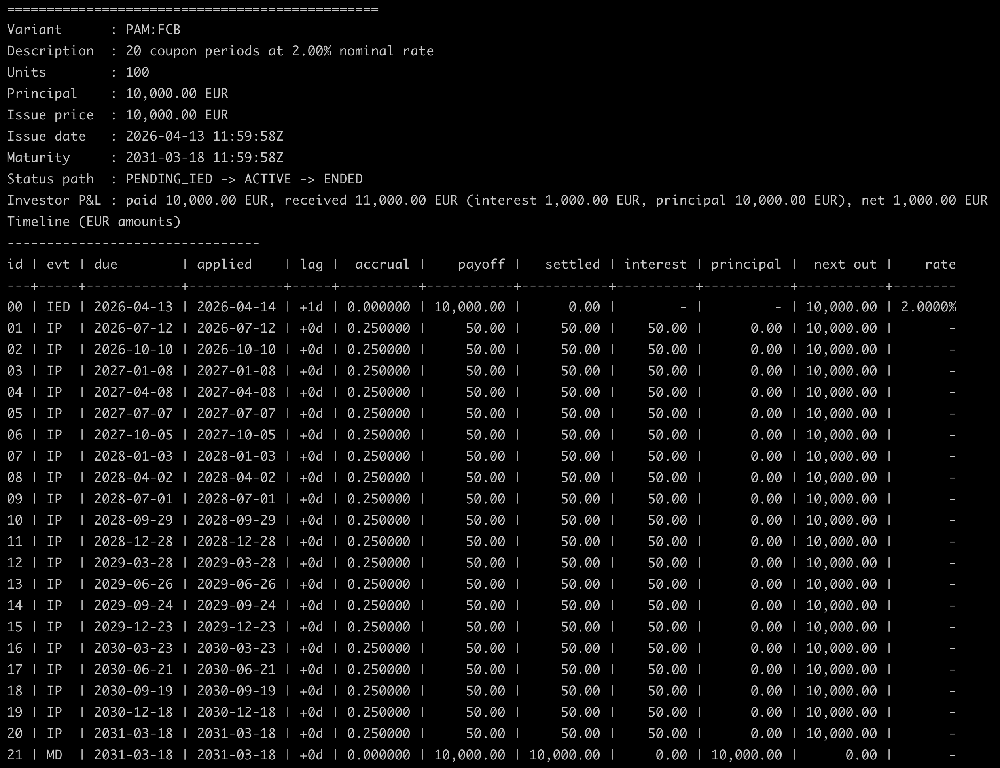

# Debt Algorand Standard Application (D-ASA)

D-ASA is a full tokenization framework for [ACTUS](https://www.actusfrf.org/)-compliant
debt instruments, issued and executed on the Algorand Virtual Machine.

```text
ACTUS Contract -> AVM Normalization -> ABI Upload -> AVM Execution
```

The canonical generated artifacts are:

- `src/d_asa/artifacts/DASA.arc56.json`: D-ASA AppSpec, generates clients and can
be used on [Lora App Lab](https://lora.algokit.io/localnet/app-lab/create);

- `src/d_asa/artifacts/dasa_client.py`: D-ASA client, expanded by the SDK;

- `src/d_asa/artifacts/dasa_avm_client.py`: D-ASA AVM client, for on-chain App-2-App
calls.

Documentation: <https://cusma.github.io/d-asa/>

High-level client docs: `docs/sdk/overview.md`

Interactive notebook examples: [`examples/README.md`](./examples/README.md)

[](https://deepwiki.com/cusma/d-asa)

## Demo in One Command



The fastest way to showcase D-ASA is with host AlgoKit for Algorand LocalNet and
Docker for the showcase runtime.

- Install [AlgoKit](https://dev.algorand.co/algokit/algokit-intro/#cross-platform-installation)
- Install [Docker](https://docs.docker.com/get-docker/)

```shell
git clone git@github.com:cusma/d-asa.git
cd d-asa
./d-asa run
```

What `./d-asa run` does:

- builds the local demo image
- starts host AlgoKit LocalNet if it is not already running
- waits for the LocalNet services required by the showcase
- runs the PAM fixed coupon and zero coupon showcase walkthroughs
- leaves LocalNet running so the Lora transaction links remain explorable

When you are finished inspecting the links:

```shell
algokit localnet stop
```

Open the published docs with:

```shell
./d-asa docs
```

Notes:

- targets macOS and Linux
- requires both Docker and AlgoKit on the host
- the demo joins the LocalNet Docker network when available, which keeps the showcase
on direct container-to-container networking

## Development

The D-ASA project is developed with [AlgoKit](https://algorand.co/algokit) and [Poetry](https://python-poetry.org/).

Bootstrap the development environment:

```shell
make install-dev
```

Verify your environment:

```shell
make doctor
```

See the available contributor commands:

```shell
make help
```

Start your Algorand LocalNet:

```shell
make localnet
```

Run the default test suite:

```shell
make test
```

Build smart contracts:

```shell
make build
```

Run the showcase tests directly:

```shell
make showcase
```

Serve docs locally with live reload:

```shell
make docs-serve
```

## Interactive Notebooks

The easiest way to explore the notebooks is using Docker (no local Python dependencies
needed):

```shell
./d-asa jupyter
```

Or via make:

```shell
make jupyter-docker
```

This will:
- Build the Docker image with Jupyter Lab included
- Start AlgoKit LocalNet if needed
- Launch Jupyter Lab at <http://localhost:8888>
- Automatically configure LocalNet connectivity

The notebooks will have full access to the D-ASA framework and LocalNet.

Press `Ctrl+C` to stop.

### Alternative: Local Jupyter (requires local dependencies)

If you prefer running Jupyter locally, first install the optional notebook dependencies:

```shell
poetry install --with notebooks
```

Then start Jupyter Lab:

```shell
poetry run jupyter lab examples/
```

## Contributing

Contributor setup and workflow guidance live in [CONTRIBUTING.md](./CONTRIBUTING.md).
