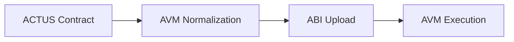

# Debt Algorand Standard Application (D-ASA)

D-ASA is an ACTUS execution engine for the Algorand Virtual Machine.



The canonical ABI artifact is:

- `src/artifacts/DASA.arc56.json`

Documentation: <https://cusma.github.io/d-asa/>

[](https://deepwiki.com/cusma/d-asa)

## Demo in One Command

The fastest way to showcase D-ASA is with Docker only.

```shell
./d-asa run
```

What `./d-asa run` does:

- builds the local demo image
- starts AlgoKit LocalNet if it is not already running
- waits for algod to become reachable
- runs the PAM fixed coupon and zero coupon showcase walkthroughs
- tears LocalNet back down if this invocation started it

Open the published docs with:

```shell
./d-asa docs
```

If you want the exact `d-asa ...` syntax in your current shell, you can add an alias:

```shell
alias d-asa="$PWD/d-asa"
```

If browser launch is not wanted:

```shell
D_ASA_NO_OPEN=1 ./d-asa docs
```

Notes:

- targets macOS and Linux
- Docker is the only required host dependency
- the demo defaults to `host.docker.internal` for LocalNet access inside the container
- advanced overrides are available through
  - `D_ASA_LOCALNET_HOST`,
  - `D_ASA_LOCALNET_TOKEN`,
  - `D_ASA_ALGOD_PORT`,
  - `D_ASA_KMD_PORT`,
  - and `D_ASA_INDEXER_PORT`

## Development

The D-ASA project is developed with [AlgoKit](https://algorand.co/algokit) and [Poetry](https://python-poetry.org/).

Bootstrap the development environment:

```shell
make install-dev
```

Verify your environment:

```shell
make doctor
```

See the available contributor commands:

```shell
make help
```

Start your Algorand LocalNet:

```shell
make localnet
```

Run the default test suite:

```shell
make test
```

Build smart contracts:

```shell
make build
```

Run the showcase tests directly:

```shell
make showcase
```

Serve docs locally with live reload:

```shell
make docs-serve
```

## Contributing

Contributor setup and workflow guidance live in [CONTRIBUTING.md](./CONTRIBUTING.md).
