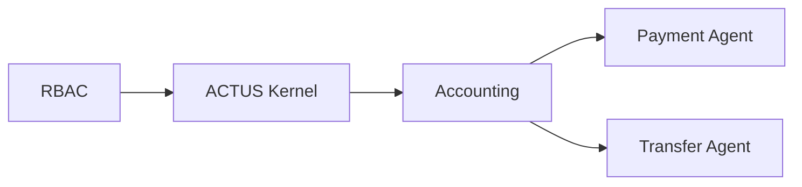
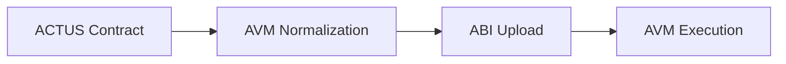
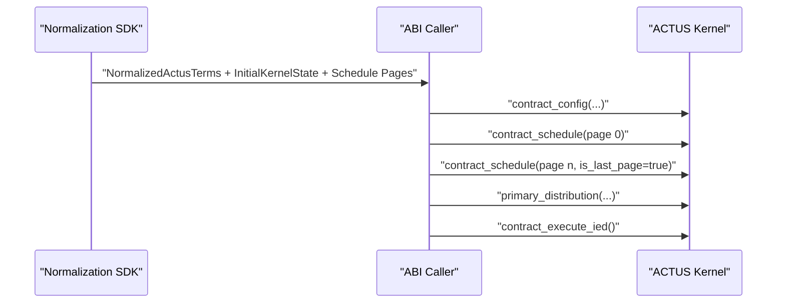
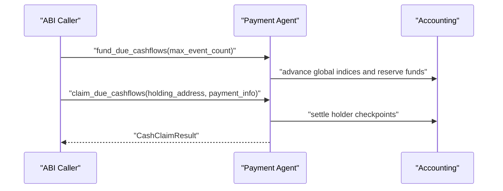
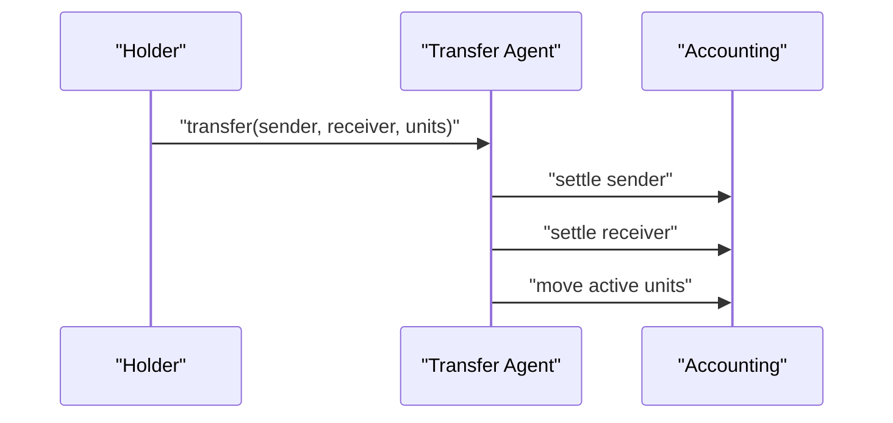

# Architecture

The current D-ASA architecture is layered, not product-specific. The on-chain contract
is a single `DASA` application assembled from five modules:

## Processing chain

The canonical processing chain is:

This separation is intentional:

- ACTUS contract definition and schedule generation happen off chain.
- Normalization converts that contract into fixed-size AVM-compatible structs.
- The AVM kernel validates and executes the normalized lifecycle.

## Module responsibilities

- `RbacModule`: role assignment, suspension, and application-control methods.

- `ActusKernelModule`: normalized-term validation, schedule storage, event cursor,
state transitions, and generic ACTUS getters.

- `AccountingModule`: holder positions, unit activation, checkpoints, and claim
ledgers.

- `PaymentAgent`: funding of due cash events and holder withdrawals.

- `TransferAgent`: primary distribution, transfer schedule, and settled unit transfers.

## Public API by layer

| Layer          | Public methods                                                                                                                                                                                               |
|:---------------|:-------------------------------------------------------------------------------------------------------------------------------------------------------------------------------------------------------------|
| RBAC           | `contract_update`, `rbac_rotate_arranger`, `rbac_set_op_daemon`, `rbac_assign_role`, `rbac_revoke_role`, `rbac_contract_suspension`, `rbac_get_arranger`, `rbac_get_address_roles`, `rbac_get_role_validity` |
| Accounting     | `account_suspension`, `account_open`, `account_update_payment_address`, `account_get_position`                                                                                                               |
| ACTUS Kernel   | `contract_create`, `contract_config`, `contract_schedule`, `contract_execute_ied`, `apply_non_cash_event`, `append_observed_cash_event`, `contract_get_state`, `contract_get_next_due_event`                 |
| Payment Agent  | `fund_due_cashflows`, `claim_due_cashflows`                                                                                                                                                                  |
| Transfer Agent | `transfer_set_schedule`, `primary_distribution`, `transfer`                                                                                                                                                  |

## Execution flows

### Configuration

### Cash events

### Transfers

