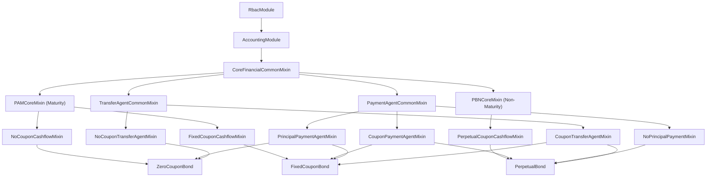
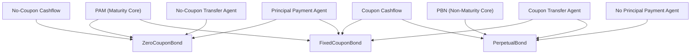
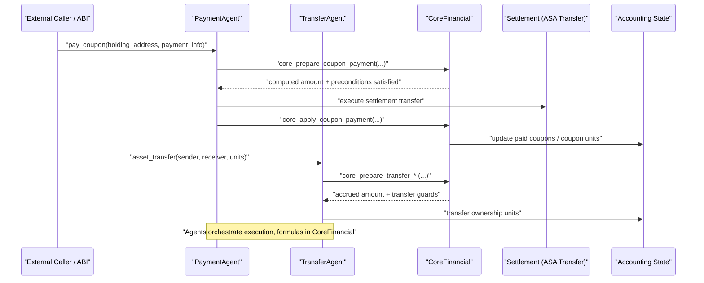

# Architecture

The D-ASA architecture is designed to support a wide range of financial products
and instrument types, fostering modularization and code reuse.

The financial contract specialization is executed compile-time composition. Each
concrete financial contract is built from _mixins_ that implement only the required
behavior.

As a result, unused flows (e.g., coupon payment for zero coupon bonds, principal
repayment for perpetual bonds) are not part of the deployed program.

## Architectural Axes

The architecture is organized along four orthogonal axes:

- Axis A: `RbacModule` and `AccountingModule`
- Axis B: Maturity-based core (`PAM`) vs Non-maturity-based core (`PBN`)
- Axis C: Coupon vs No-coupon cashflow
- Axis D: `CoreFinancial` (compute), `PaymentAgent` (execute payments),
  `TransferAgent` (transfer ownership)

## High-level architecture

## Module responsibilities

- `CoreFinancialCommonMixin`: shared asset configuration, schedule validation, and
  state/getter primitives.
  Must not do: payment settlement execution.

- `PAMCoreMixin`: maturity-driven lifecycle and principal redemption authorization.
  Must not do: perpetual-only logic.

- `PBNCoreMixin`: non-maturity lifecycle and perpetual-oriented schedule base.
  Must not do: maturity principal flow.

- `CouponCashflowMixin`: coupon due counting, coupon ordering constraints, and coupon-related
  cashflow preconditions.
  Must not do: settlement transfer execution.

- `NoCouponCashflowMixin`: discount/accrual logic for no-coupon instruments.
  Must not do: coupon sequencing logic.

- `PaymentAgentCommonMixin`: payment executability checks, liquidity checks, and
  settlement transaction execution.
  Must not do: interest/day-count formulas.

- `CouponPaymentAgentMixin`: executes `pay_coupon` using core-computed amount and
  core state transition hooks.
  Must not do: coupon formula computation.

- `PrincipalPaymentAgentMixin`: executes `pay_principal` using core-computed amount
  and core state transition hooks.
  Must not do: maturity or coupon-ordering math.

- `NoPrincipalPaymentMixin`: explicit no-principal specialization (no `pay_principal`).
  Must not do: expose principal payment flow.

- `TransferAgentCommonMixin`: shared transfer-agent composition point.
  Must not do: cashflow formulas.

- `CouponTransferAgentMixin`: ownership transfer with coupon-payment ordering guards
  delegated to core hooks.
  Must not do: coupon rate/day-count calculations.

- `NoCouponTransferAgentMixin`: ownership transfer for no-coupon instruments with
  accrual delegated to core hooks.
  Must not do: coupon sequencing checks.

## Composition Matrix

Current supported combinations:

- `PAM + no-coupon` -> `ZeroCouponBond`
- `PAM + coupon` -> `FixedCouponBond`
- `PBN + coupon` -> `PerpetualBond`

## Execution flow by agent

## Contract API surface

| Method / Surface                                                               | Zero | Fixed | Perpetual |
|--------------------------------------------------------------------------------|------|-------|-----------|
| `asset_config`                                                                 | Yes  | Yes   | Yes       |
| `asset_transfer`                                                               | Yes  | Yes   | Yes       |
| `pay_coupon`                                                                   | No   | Yes   | Yes       |
| `pay_principal`                                                                | Yes  | Yes   | No        |
| `update_interest_rate`                                                         | No   | No    | Yes       |
| Core getters (`get_asset_info`, `get_time_events`, `get_asset_metadata`, etc.) | Yes  | Yes   | Yes       |
| Coupon getters (`get_coupon_rates`, `get_coupons_status`)                      | No   | Yes   | Yes       |
| `get_time_periods`                                                             | No   | No    | Yes       |

## Composition Safety

Contract composition is validated at build time before contract compilation.

- Agent mixins (`CouponTransferAgentMixin`, `NoCouponTransferAgentMixin`,
  `CouponPaymentAgentMixin`, `PrincipalPaymentAgentMixin`) must resolve their core
  hook methods to safe implementations.
- If a hook resolves to an unsafe default in agent-common mixins, build validation
  fails before compilation.
- Core financial hook defaults also fail-closed with `INVALID_MIXIN_COMPOSITION`
  and must be resolved by the expected cashflow/core mixins in the effective MRO.
- Unsafe default hooks are fail-closed and abort with `INVALID_MIXIN_COMPOSITION`
  if reached.
- Build and deploy flows verify generated `.teal` and `.arc56.json` artifacts do
  not contain `INVALID_MIXIN_COMPOSITION` markers.

This prevents missing mixins or incorrect MRO ordering from silently producing
fail-open settlement behavior.

## On-chain optimization outcome

Contracts are assembled from only the mixins required for each product. This removes
unreachable logic from deployment artifacts and keeps method selectors, state usage,
and control flow minimal for each contract.

Examples:

- `ZeroCouponBond` excludes `pay_coupon`.
- `PerpetualBond` excludes `pay_principal`.
