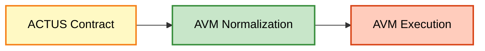

# Contract {#contract}

> Financial contracts are legal agreements between two (or more) counterparties
> on the exchange of future cash flows. Debt instruments are a subset of financial
> contracts.

This section specifies the D-ASA ACTUS contract layer.

A conforming D-ASA **MUST** express the debt instrument as:

1. ACTUS contract attributes;

1. Normalized ACTUS terms, initial kernel state, and execution schedule for the
AVM;

1. Explicit AVM execution of due ACTUS events.

The canonical execution chain is, therefore:

The following pages define:

- The supported ACTUS compliance profile;
- The normalized on-chain state and schedule model;
- The contract normalization and configuration flow;
- The numeric representation rules required to move ACTUS values onto the AVM.
