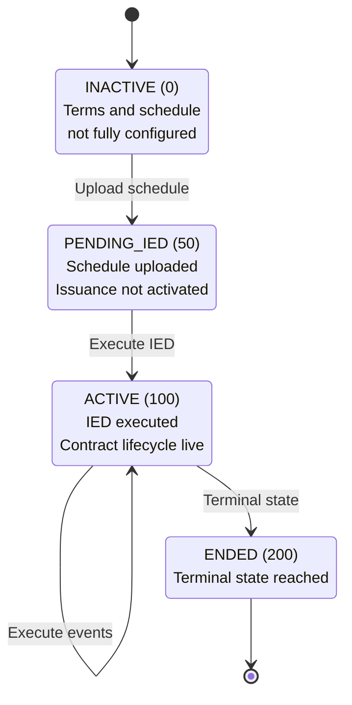

# Kernel State and Schedule

The ACTUS kernel stores the executable contract as three normalized payload classes:

1. `NormalizedActusTerms`
1. `InitialKernelState`
1. `ExecutionScheduleEntry[]`

## Normalized Terms

`NormalizedActusTerms` **MUST** contain the immutable or quasi-immutable contract
configuration required by the kernel, including:

- Contract Type ID;
- Denomination asset ID and Settlement asset ID;
- Total units;
- Notional Principal;
- Initial Exchange Amount and Date;
- Maturity Date;
- Day-Count Convention ID;
- Rate Reset parameters;
- Dynamic-principal-redemption flags;
- Fixed-point scale.

## Initial kernel state

`InitialKernelState` **MUST** capture the pre-`IED` kernel state snapshot uploaded
with `contract_config`. It defines:

- Status Date \\( [SD] \\);
- Starting event cursor;
- Outstanding principal;
- Interest calculation base;
- Current nominal rate;
- Accrued interest;
- Next principal redemption;
- Cumulative interest and principal indices.

## Execution schedule

Each `ExecutionScheduleEntry` **MUST** contain:

- A contiguous `event_id`;
- An ACTUS `event_type`;
- `scheduled_time`;
- Precomputed accrual factors;
- The next normalized rate and principal state;
- Entry flags.

The schedule **MUST** satisfy the following invariants:

- `event_id = 0` **MUST** be `IED`;
- Event IDs **MUST** be contiguous across all pages;
- Schedule entries **MUST** be ordered by nondecreasing `scheduled_time`;
- Page size **MUST NOT** exceed `16` entries in the current kernel;
- The last uploaded page **MUST** finalize `schedule_entry_count` and move the
contract to `STATUS_PENDING_IED`.

## ACTUS cycles

ACTUS cycles are an off-chain schedule-generation concept. They define recurring
periods before normalization resolves them into concrete timestamps.

The D-ASA SDK models ACTUS cycles with the syntax:

```text
<count><unit>[+|-]
```

where:

- `count` is a positive integer;
- `unit` is one of `D`, `W`, `M`, `Q`, `H`, `Y`;
- `+` and `-` are optional ACTUS stub markers.

Examples:

- `90D`
- `3M`
- `1Q`
- `1H`
- `2Y`
- `3M+`
- `1Q-`

Cycles are used together with ACTUS anchors in `ContractAttributes`, such as:

- `interest_payment_anchor` + `interest_payment_cycle`
- `principal_redemption_anchor` + `principal_redemption_cycle`
- `rate_reset_anchor` + `rate_reset_cycle`

The normalization process **MUST** resolve those cycles into explicit schedule entries
before the contract is uploaded to the AVM.

As a result, the on-chain kernel does not store raw ACTUS cycles. It stores only
the normalized timestamps and state transitions that were derived from those cycles.

## Contract status machine

The kernel uses the following status identifiers:

| Status        | ID    | Meaning                                       |
|:--------------|:------|:----------------------------------------------|
| `INACTIVE`    | `0`   | Terms and schedule not fully configured       |
| `PENDING_IED` | `50`  | Schedule uploaded; issuance not yet activated |
| `ACTIVE`      | `100` | `IED` executed; contract lifecycle is live    |
| `ENDED`       | `200` | Terminal state reached                        |



## Due-event execution

The kernel advances the schedule through explicit ABI calls:

- `contract_execute_ied` applies the first due `IED`;
- `apply_non_cash_event` applies the next due non-cash event after `IED`;
- `fund_due_cashflows` processes due cash events and advances the cursor;
- `contract_get_next_due_event` returns the next due entry, or a zero sentinel after
end.

This split is the normative execution model for D-ASA.
