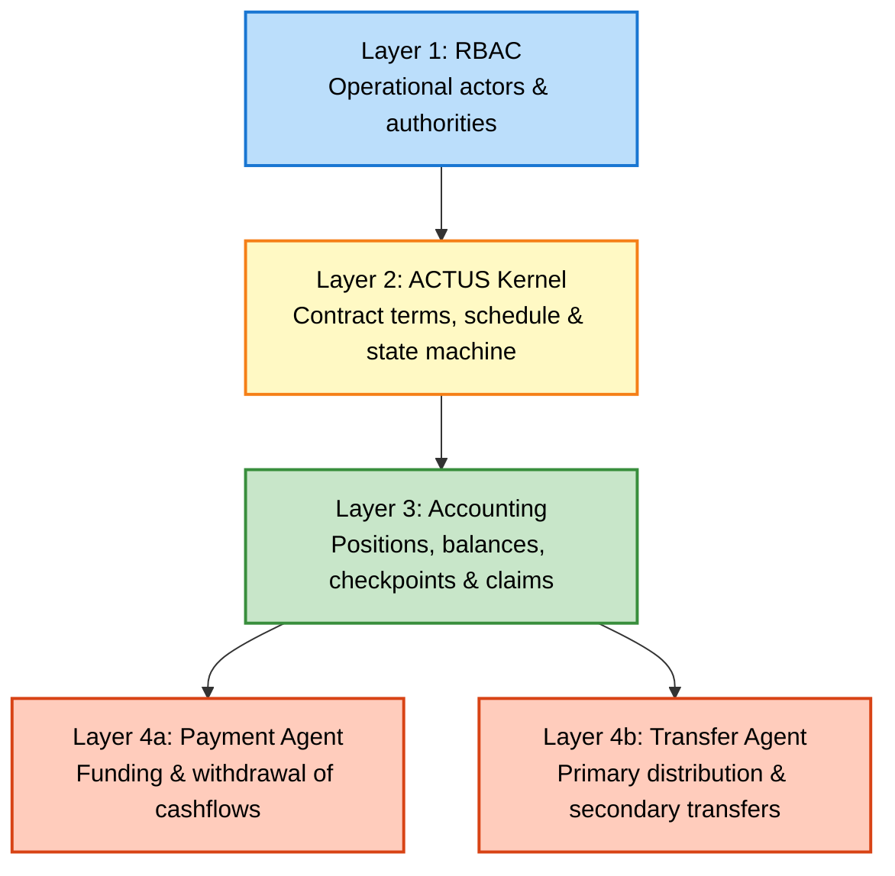

# Overview {#overview}

A *Debt Algorand Standard Application* (D-ASA) is an Algorand application that
executes a fixed-income ACTUS contract on the AVM.

A conforming D-ASA **MUST** process a debt instrument through the following stages:

1. Define the debt instrument as an ACTUS contract.

1. Normalize the ACTUS contract into AVM-compatible integers, state, and schedule
pages.

1. Execute the normalized contract on the AVM through explicit ABI methods.

The D-ASA therefore uses the AVM as the execution layer of ACTUS. The canonical
contract interface is the normalized ACTUS interface defined in this specification.

This specification is structured in four layers:

1. **RBAC**: identifies operational actors and their authorities.

1. **ACTUS Kernel**: defines the normalized contract terms, schedule, and lifecycle
state machine.

1. **Accounting**: defines holder positions, unit balances, checkpoints, and claims.

1. **Execution**: executes the ACTUS cashflows and tokenized contract transfers.

   - *Payment Agent*: defines funding and withdrawal of due ACTUS cashflows.

   - *Transfer Agent*: defines primary distribution and secondary transfer execution.

---

---

## Conformance

A conforming implementation:

- **MUST** implement the public ABI described in the [Interfaces](../interfaces/types.md)
section;

- **MUST** accept normalized ACTUS terms, an initial kernel state, and a paged execution
schedule;

- **MUST** execute ACTUS non-cash and cash events through the kernel and agent interfaces;

- **MUST** follow the ACTUS compliance profile defined in the [Contract](./contract/intro.md)
section.

## ACTUS compliance

D-ASA is designed to be ACTUS-compliant, with three minor deviations required by
AVM constraints:

|                | ACTUS                                              | D-ASA                                           |
|:---------------|:---------------------------------------------------|:------------------------------------------------|
| Time format    | [ISO 8601](https://en.wikipedia.org/wiki/ISO_8601) | [UNIX](https://en.wikipedia.org/wiki/Unix_time) |
| Time precision | Millisecond \\( 10^{-3} [s] \\)                    | Second \\( [s] \\)                              |
| Arithmetic     | Floating-point                                     | Fixed-point                                     |

> The ACTUS compliance has not yet been certified by an *official* ACTUS standardization
> body.
